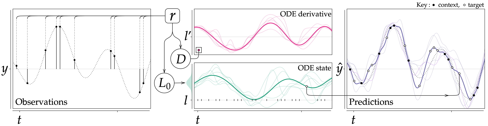

# Neural ODE Processes

Official code for the paper [Neural ODE Processes](https://openreview.net/forum?id=27acGyyI1BY) (ICLR 2021). 



## Abstract

Neural Ordinary Differential Equations (NODEs) use a neural network to model the instantaneous rate
of change in the state of a system. However, despite their apparent suitability for dynamics-governed 
time-series, NODEs present a few disadvantages. First, they are unable to adapt to incoming data-points,
a fundamental requirement for real-time applications imposed by the natural direction of time. 
Second, time-series are often composed of a sparse set of measurements that could be explained by 
many possible underlying dynamics. NODEs do not capture this uncertainty. In contrast, Neural Processes (NPs) 
are a new class of stochastic processes providing uncertainty estimation and fast data-adaptation, 
but lack an explicit treatment of the flow of time. To address these problems, we introduce Neural 
ODE Processes (NDPs), a new class of stochastic processes determined by a distribution over Neural ODEs.
By maintaining an adaptive data-dependent distribution over the underlying ODE, we show that our model 
can successfully capture the dynamics of low-dimensional systems from just a few data-points. 
At the same time, we demonstrate that NDPs scale up to challenging high-dimensional time-series with 
unknown latent dynamics such as rotating MNIST digits.

```
@inproceedings{
    norcliffe2021neural,
    title={Neural {\{}ODE{\}} Processes},
    author={Alexander Norcliffe and Cristian Bodnar and Ben Day and Jacob Moss and Pietro Li{\`o}},
    booktitle={International Conference on Learning Representations},
    year={2021},
    url={https://openreview.net/forum?id=27acGyyI1BY}
}
```

## Getting started

For development, we used `Python 3.8.5` and `PyTorch 1.8`. First, install `PyTorch`
and `torchvision` using the [official page](https://pytorch.org/) and then run the following command to install
the requited packages:
```bash
pip install -r requirements.txt
```

## Running the experiments

To run the 1D regression experiments, run one of the following commands:

```bash
python -m main.1d_regression --model ndp --exp_name ndp_sine --data sine --epochs 30
python -m main.1d_regression --model ndp --exp_name ndp_exp --data exp --epochs 30
python -m main.1d_regression --model ndp --exp_name ndp_linear --data linear --epochs 30
python -m main.1d_regression --model ndp --exp_name ndp_oscil --data oscil --epochs 30
```

To run the 2D regression experiments use one of the following 

```bash
python -m main.2d_regression --model ndp --exp_name ndp_lv --data deterministic_lv --epochs 100
python -m main.2d_regression --model ndp --exp_name ndp_hw --data handwriting --epochs 100
```

To run the high-dimensional regression experiments use:
```bash
python -m main.img_regression --model ndp --exp_name ndp_vrm --data VaryRotMNIST --use_y0 --epochs 50
python -m main.img_regression --model ndp --exp_name ndp_rr --data RotMNIST --use_y0 --epochs 50
```

## Datasets

To use the rotating MNIST datasets, run the script below in order to download the required data:
```bash
bash data/download_datasets.sh
```

## Credits

Our code relies to a great extent on the [Neural Process implementation](https://github.com/EmilienDupont/neural-processes) by 
Emilien Dupont. The RotMNIST dataset code adapts the [ODE2VAE code](https://github.com/cagatayyildiz/ODE2VAE).

